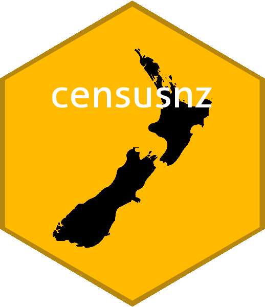

<!-- README.md is generated from README.Rmd. Please edit that file -->

# censusnz 

<!-- badges: start -->

[](https://gitlab.harmonic.co.nz/harmonic/packages/censusnz/pipelines)
[](https://gitlab.harmonic.co.nz/harmonic/packages/censusnz/commits/master)
<!-- badges: end -->

This package provides an interface to the NZ Census data, returning
tidyverse-ready data frames.

Currently, the **censusnz** package provides data for seven geographical
areas:

-   **SA1**: Statistical Area 1
-   **SA2**: Statistical Area 2
-   **WARD**: Ward
-   **DHB**: District Health Board
-   **LBA**: Local Board Area (Auckland region only)
-   **TA**: Territorial Authority
-   **RC**: Regional Council

This package automatically installs the **db.censusnz** package.

## Installation

To install this package from gitlab, you must first generate a Personal
Access Token; the package can then be installed using the Remotes
package:

``` r
remotes::install_gitlab(repo = 'harmonic/packages/censusnz', auth_token = <PAT>, host = 'gitlab.harmonic.co.nz')
```

## Examples

The package includes a vignettes detailing the use of the provided
functions. To view this vignette run the following after installing the
package:

``` r
vignette("Example 01", package = "censusnz")
```
