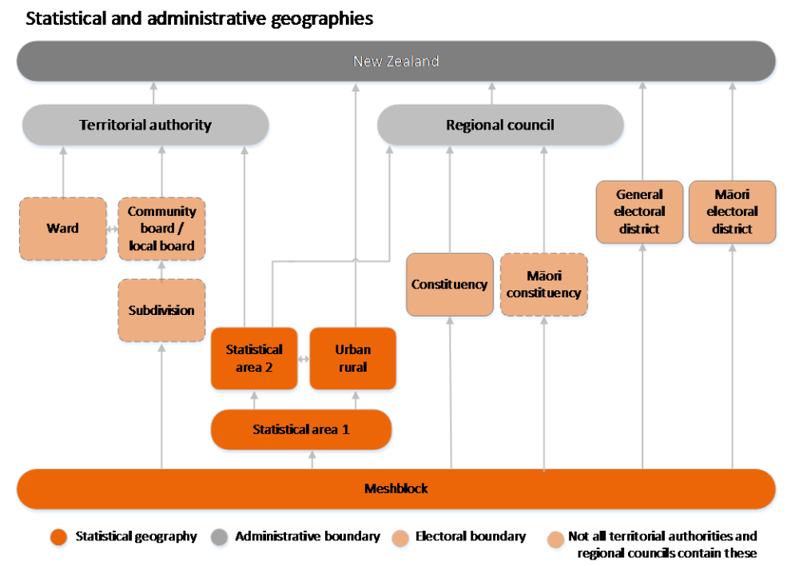

This example demonstrates the functions `get_variables`, `get_data` and
`plot_data` which are included in `censusnz`.

```{r, include = FALSE}
pkgload::load_all(export_all=FALSE, helpers=FALSE)
knitr::opts_chunk$set(
  collapse = TRUE,
  comment = "#>"
)
```

```{r setup}
library(censusnz)
```

To begin investigating NZ Census data, running `get_variables` will provide a
list of all the available variables and the geographical levels at which they
are available. It is useful for general exploration as well as confirmation of
the exact names of variables in the data.

```{r}
vars <- get_variables()
vars
```

This is a bit overwhelming. Let's narrow our search down, for example to data on
smoking and employment.

```{r}
relevant_vars <- vars %>% 
  dplyr::filter(grepl("employment", variable, fixed = TRUE) |
                  grepl("smoking", variable, fixed = TRUE))
relevant_vars
```

We have found variables `status_in_employment` and `smoking_status` as
expected, and we have these variables for a range of geographical levels. To
select a geographical level, consider the breakdown of their relationships from
Stats NZ.

{width=100%}

We can compare with the codes for the available regions.

```{r}
vars$geography %>% unique()
```

We can match most of these with their respective blocks on the diagram. Let's
say we are interested in the most general geographical level available, `SA1`.
We construct our first call to `get_data()`.

```{r}
my_data <- get_data(geography = "SA1",
                    variables = c("status_in_employment", "smoking_status"),
                    year = 2018)
my_data
```

This is our first look at an output from `get_data()`. We have the columns we
would expect, such as `variable` and `count`, as well as `variable_group` which 
describes various groupings of individuals by their answers to census questions.
We also have some extra columns:

|Variable   |Description                                                                    |
|-----------|-------------------------------------------------------------------------------|
|`geoid`    |A unique ID for the geographical unit based on the area hierarchy              |
|`land_type`|The land type, e.g. "Mainland", "Inlet", "Island", "Mixture"                   |
|`name`     |A name for the geographical unit if available. More informative at lower levels|

In this case `SA1` units do not have informative names so the `geoid` and `name`
columns are identical.

Maybe instead of `SA1`, we investigate the data by `RC` unit, for Regional Councils.

```{r}
my_data <- get_data(geography = "RC",
                    variables = c("status_in_employment", "smoking_status"))
my_data
```

This could be more informative. To visualise these figures, use the `plot_data`
function. First we will try with all the default argument values.

```{r fig.align = 'center', fig.height = 7, fig.width = 7}
plot_data(geography = "RC", variables = c("status_in_employment", "smoking_status"))
```

By default this plots the 6 regions with the highest count. However, `plot_data`
has additional arguments to customise this output. For example:

```{r fig.align = 'center', fig.height = 7, fig.width = 7}
plot_data(geography = "RC",
          variables = c("status_in_employment", "smoking_status"),
          n = 4,
          exclude_other = FALSE,
          exclude_total = FALSE)
```

`exclude_total` removes the Total NZ category if it exists and `exclude_other` 
ignores lumping of categories into "other". When we set `exclude_other` and
`exclude_total` to FALSE, we now have these extra categories included in our
output.

With these set to FALSE we can see that Total NZ has the highest counts, which
is expected. Auckland Region is the largest single region by count, and 'Other'
encompasses all remaining regions. The counts for Auckland and Other should add
to the same as Total NZ.

Note that using `exclude_total = FALSE` often introduces issues with the scale
of smaller regions on the same plot. Using `position = "fill"` can be helpful to
address this, displaying a stacked bar graph by proportion instead of absolute
heights.

```{r fig.align = 'center', fig.height = 7, fig.width = 7}
plot_data(geography = "RC",
          variables = c("status_in_employment", "smoking_status"),
          n = 4,
          position = "fill",
          exclude_other = TRUE,
          exclude_total = FALSE)
```

We can make several general observations about individuals 15 years and 
over:

* Most individuals have never smoked
* There are slightly more ex-smokers than regular smokers
* The vast majority of individuals are employed
* More individuals are self-employed without employees than are employers
* There are relatively very small numbers of individuals who are unpaid family
workers or not elsewhere included

We can investigate this final point further:

```{r}
my_data_RC <- get_data(geography = "RC", variables = "status_in_employment")
vargroup_summary <- my_data_RC[my_data_RC$name == "Total NZ (Regional Council)", c("variable_group", "count")] %>%
  dplyr::group_by(variable_group) %>% 
  dplyr::summarise(n = sum(count), .groups = "drop_last")
vargroup_summary[order(vargroup_summary$n), ]
```

Plotting by proportion is also helpful for direct comparison, using the `regions`
argument and `position = "fill"`.

```{r fig.align = 'center', fig.height = 7, fig.width = 7}
plot_data(geography = "RC",
          variables = c("status_in_employment", "smoking_status"),
          regions = c("Auckland Region", "Wellington Region"),
          position = "fill")
```

We can see that Auckland region has a higher proportion of individuals who have
never smoked than Wellington, and Wellington has far more ex-smokers. However, 
Auckland and Wellington have very similar compositions of employment status.
